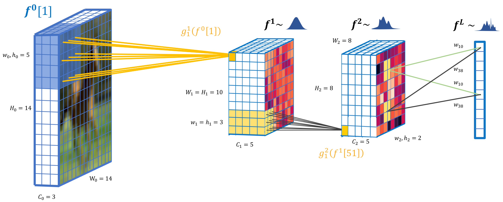

# Deep convolutional gaussian processes

This repository implements deep convolutional gaussian processes, a deep gaussian process model for hierarchically detecting combinations of local features in images.

We've written about the method in our paper titled [Deep Convolutional Gaussian Processes](https://arxiv.org/abs/1810.03052).
> We propose deep convolutional Gaussian processes, a deep Gaussian process architecture with convolutional structure. The model is a principled Bayesian framework for detecting hierarchical combinations of local features for image classification. We demonstrate greatly improved image classification performance compared to current Gaussian process approaches on the MNIST and CIFAR-10 datasets. In particular, we improve CIFAR-10 accuracy by over 10 percentage points.
>
> -- <cite>Kenneth Blomqvist, Samuel Kaski, Markus Heinonen</cite>

The figures in the paper have been generated using this [notebook](notebooks/Inspect.ipynb).

## Setup

This package uses the doubly stochastic deep gaussian process package. It has been included as a submodule to this repository. To install it run `sh ./init.sh`. This will initialize submodule and install the doubly stochastic deep gp package.

To install other dependencies run `pip install -r requirements.txt`.

## Running experiments

To run the mnist experiment run `python conv_gp/mnist.py`. Parameters and a number of options can be set using command line arguments. To see a full list of options run `python conv_gp/mnist.py --help`.

The CIFAR-10 experiment located at `conv_gp/cifar.py` works similarly.
